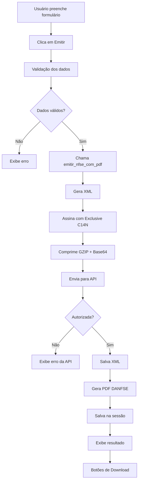

# 🚀 Dashboard Aprimorado - NFS-e com Download de XML e PDF

## ✨ O que foi implementado

Criei uma versão aprimorada do dashboard Streamlit com **funcionalidades completas de emissão e download** de NFS-e!

### 📋 Arquivo Criado

**`app_nfse_enhanced.py`** - Dashboard completo com todas as funcionalidades integradas

---

## 🎯 Principais Funcionalidades

### 1️⃣ **Emissão Individual de NFS-e**

Interface completa para emitir NFS-e individuais com:

- ✅ Formulário completo de dados do tomador
- ✅ Endereço completo (CEP, logradouro, número, bairro, cidade, UF)
- ✅ Configuração do serviço (valor, alíquota ISS, item lista)
- ✅ Descrição e discriminação do serviço
- ✅ Opções: Incentivador Cultural, Simples Nacional
- ✅ **Emissão automática de XML + PDF**
- ✅ **Botões de download imediatos após emissão**

### 2️⃣ **Listagem de NFS-e Emitidas**

Página dedicada para visualizar todas as NFS-e emitidas:

- 📊 **Métricas**: Total de NFS-e, Valor Total, Total ISS
- 🔍 **Filtros**: Por nome, CPF/CNPJ
- 📈 **Ordenação**: Mais recentes, mais antigas, maior/menor valor
- 📥 **Downloads**: Botões para baixar XML e PDF de cada nota
- 👁️ **Visualização**: Ver conteúdo do XML diretamente no navegador
- 🔑 **Chave de Acesso**: Exibição clara da chave de cada NFS-e

### 3️⃣ **Dashboard Principal (Overview)**

Visão geral do sistema:

- 📊 Métricas gerais (NFS-e emitidas, valor total)
- 📋 Últimas 5 emissões com downloads rápidos
- ✅ Status do sistema e certificado

### 4️⃣ **Configurações**

- 🔐 Informações do certificado digital (CNPJ, validade, status)
- 🌐 Configuração da API (ambiente, URL, timeout)
- 🗑️ Manutenção (limpar histórico, reiniciar sessão)

---

## 🚀 Como Usar

### Opção 1: Executar o Dashboard Aprimorado

```powershell
# Navegue até o diretório do projeto
cd "d:\leitor pdf e geração de notas"

# Execute o dashboard aprimorado
streamlit run app_nfse_enhanced.py
```

### Opção 2: Substituir o Dashboard Antigo

Se quiser tornar o novo dashboard o padrão:

```powershell
# Backup do app antigo
mv app.py app_old.py

# Renomear o novo como principal
mv app_nfse_enhanced.py app.py

# Executar
streamlit run app.py
```

---

## 📸 Fluxo de Uso

### 1. **Login**
```
🔐 Sistema de Emissão NFS-e
┌─────────────────────────┐
│ Usuário: admin          │
│ Senha: ********         │
│ [🚀 Entrar]             │
└─────────────────────────┘
```

### 2. **Menu Principal**
```
⚙️ Menu Principal
👤 Usuário: admin
─────────────────
○ 📊 Dashboard
● 📤 Emissão Individual
○ 📋 Emissão em Lote
○ 📜 NFS-e Emitidas
○ ⚙️ Configurações
[🚪 Sair]
```

### 3. **Emissão Individual**
```
📤 Emissão Individual de NFS-e

👤 Dados do Tomador
┌──────────────────────────────────────┐
│ CPF/CNPJ: 12345678901                │
│ Nome: João Silva                      │
│ E-mail: joao@email.com                │
│ Telefone: (51) 99999-9999             │
└──────────────────────────────────────┘

🏠 Endereço do Tomador
┌──────────────────────────────────────┐
│ CEP: 90000-000                        │
│ Logradouro: Rua Exemplo               │
│ Número: 123                           │
│ Bairro: Centro                        │
│ Cidade: Porto Alegre                  │
│ UF: RS                                │
└──────────────────────────────────────┘

💼 Dados do Serviço
┌──────────────────────────────────────┐
│ Valor: R$ 100,00                      │
│ Alíquota ISS: 2%                      │
│ Item Lista: 1.09                      │
│ Descrição: Serviços de consultoria   │
└──────────────────────────────────────┘

[🚀 Emitir NFS-e]
```

### 4. **Resultado da Emissão**
```
✅ NFS-e Emitida com Sucesso!

┌─────────────────────────────────────┐
│ Número    │ Valor        │ ISS      │
│ 3         │ R$ 100,00    │ R$ 2,00  │
└─────────────────────────────────────┘

🔑 Chave de Acesso:
42054072259418245000186000000000000326017884398537

📥 Downloads
[📄 Baixar XML]  [📑 Baixar PDF]
```

### 5. **Lista de NFS-e Emitidas**
```
📜 NFS-e Emitidas

🔍 Filtros
[Nome: _______] [CPF: _______] [Ordenar: Mais Recentes ▼]

┌───────────────────────────────────────────────────────┐
│ 📊 Métricas                                           │
│ Total: 3 NFS-e  │ Valor Total: R$ 300,00  │ ISS: R$ 6,00 │
└───────────────────────────────────────────────────────┘

▼ 🧾 NFS-e #3 - João Silva - R$ 100,00 - 15/01/2025 14:30
  
  🔑 Chave de Acesso:
  42054072259418245000186000000000000326017884398537
  
  👤 Tomador: João Silva
  📋 CPF/CNPJ: 123.456.789-01
  📅 Data: 15/01/2025 14:30:45
  
  💰 Valores:
  Valor Total: R$ 100,00
  ISS: R$ 2,00
  
  📥 Downloads
  [📄 Baixar XML]  [📑 Baixar PDF]  [👁️ Visualizar XML]
```

---

## 🔧 Funcionalidades Técnicas

### Sistema de Sessão
```python
st.session_state.emitted_nfse = []  # Lista de NFS-e emitidas
st.session_state.last_emission = None  # Última emissão
```

### Integração com emitir_nfse_completo.py
```python
from emitir_nfse_completo import emitir_nfse_com_pdf

resultado = asyncio.run(emitir_nfse_com_pdf(prestador, tomador, servico))

# Retorna:
{
    'sucesso': True,
    'chave_acesso': '42054072259418245000186000000000000326017884398537',
    'numero': '3',
    'xml_path': 'nfse_7884398537.xml',
    'pdf_path': 'nfse_7884398537.pdf',
    'resultado': {...}
}
```

### Botões de Download
```python
def download_file_button(file_path: str, label: str, key: str):
    """Cria botão de download para arquivo."""
    with open(file_path, 'rb') as f:
        file_data = f.read()
    
    st.download_button(
        label=label,
        data=file_data,
        file_name=Path(file_path).name,
        mime='application/octet-stream',
        key=key
    )
```

---

## 📦 Estrutura de Dados da NFS-e

Cada NFS-e emitida é armazenada no `session_state` com:

```python
{
    'chave_acesso': 'string (44 dígitos)',
    'numero': 'string',
    'data_emissao': 'DD/MM/YYYY HH:MM:SS',
    'tomador_nome': 'string',
    'tomador_cpf': 'string',
    'valor': float,
    'iss': float,
    'xml_path': 'caminho/para/arquivo.xml',
    'pdf_path': 'caminho/para/arquivo.pdf',
    'resultado_completo': {...}
}
```

---

## ✅ Validações Implementadas

### Emissão Individual
- ✅ Campos obrigatórios (CPF, Nome, Valor)
- ✅ Formatação de CPF/CNPJ (remove caracteres especiais)
- ✅ Validação de valores numéricos
- ✅ Estados (UF) com seleção dropdown

### Downloads
- ✅ Verifica existência do arquivo antes de disponibilizar
- ✅ Tratamento de erros ao ler arquivos
- ✅ Mensagens claras em caso de arquivo não encontrado

---

## 🎨 Melhorias de UX/UI

### Emojis e Ícones
- 📤 Emissão
- 📋 Listagem
- 📄 XML
- 📑 PDF
- 🔑 Chave de Acesso
- 👤 Tomador
- 💰 Valores
- ✅ Sucesso
- ❌ Erro

### Layout Responsivo
- Colunas adaptativas (st.columns)
- Expansores para detalhes
- Métricas visuais (st.metric)
- Formulários organizados

### Feedback Visual
- ⏳ Spinner durante emissão
- ✅ Mensagens de sucesso
- ❌ Mensagens de erro
- 📊 Métricas em tempo real

---

## 🔄 Fluxo de Emissão Completo



---

## 🧪 Como Testar

### 1. **Teste de Emissão Individual**

```powershell
# Execute o dashboard
streamlit run app_nfse_enhanced.py
```

1. Faça login (admin/senha conforme configurado)
2. Acesse **"📤 Emissão Individual"**
3. Preencha os dados:
   - CPF: 12345678901
   - Nome: Teste Cliente
   - Valor: R$ 100,00
   - ISS: 2%
4. Clique em **"🚀 Emitir NFS-e"**
5. Aguarde o processamento (⏳)
6. Veja o resultado com chave de acesso
7. Clique em **"📄 Baixar XML"** e **"📑 Baixar PDF"**

### 2. **Teste de Listagem**

1. Após emitir algumas NFS-e, acesse **"📜 NFS-e Emitidas"**
2. Veja a lista completa com métricas
3. Use os filtros (Nome, CPF)
4. Ordene por diferentes critérios
5. Expanda uma NFS-e para ver detalhes
6. Teste os downloads

### 3. **Teste de Dashboard**

1. Acesse **"📊 Dashboard"**
2. Veja as métricas gerais
3. Verifique as últimas 5 emissões
4. Teste downloads rápidos

---

## 🐛 Troubleshooting

### Problema: Erro ao importar emitir_nfse_completo

**Solução:** Certifique-se de que `emitir_nfse_completo.py` está no mesmo diretório:

```powershell
ls emitir_nfse_completo.py
```

### Problema: Arquivo não encontrado ao baixar

**Solução:** Verifique se os arquivos XML/PDF foram gerados:

```powershell
ls nfse_*.xml
ls nfse_*.pdf
```

### Problema: Erro na emissão

**Solução:** Verifique os logs:

```python
# No código, temos:
app_logger.error(f"Erro na emissão: {e}", exc_info=True)
```

Veja o terminal/console onde o Streamlit está rodando.

---

## 📊 Comparação: Antigo vs Novo

| Funcionalidade | Dashboard Antigo | Dashboard Novo |
|----------------|------------------|----------------|
| Emissão Individual | ❌ | ✅ |
| Download XML | ❌ | ✅ |
| Download PDF | ❌ | ✅ |
| Listagem de NFS-e | Básica | ✅ Completa |
| Filtros | ❌ | ✅ |
| Ordenação | ❌ | ✅ |
| Visualização XML | ❌ | ✅ |
| Métricas | Básicas | ✅ Detalhadas |
| UX/UI | Simples | ✅ Aprimorada |

---

## 🎯 Próximos Passos (Futuras Melhorias)

### 1. **Emissão em Lote Real**
- Implementar processamento de PDF com múltiplos registros
- Barra de progresso para lote
- Relatório de sucessos/falhas

### 2. **Integração com Banco de Dados**
- Persistir NFS-e emitidas em SQLite/PostgreSQL
- Busca avançada por período, valor, etc.
- Histórico permanente

### 3. **Numeração Automática**
- Sistema de numeração sequencial automático
- Controle de séries
- Prevenção de duplicatas

### 4. **Consulta de NFS-e**
- Integração com endpoint GET da API
- Consulta por chave de acesso
- Status de NFS-e

### 5. **Relatórios**
- Relatório mensal de emissões
- Exportação para Excel/CSV
- Gráficos de análise

### 6. **Segurança**
- Autenticação com JWT real
- Controle de permissões
- Auditoria de ações

---

## 📝 Notas Importantes

### Dados do Prestador
O CNPJ do prestador está fixo no código:
```python
prestador = {
    'cnpj': '59418245000186',  # Configurável
}
```

Para alterar, edite a linha no arquivo ou crie uma configuração.

### Ambiente de Teste
O dashboard usa o ambiente configurado em `settings.py`:
```python
ENVIRONMENT = "homologacao"  # ou "producao"
NFSE_API_BASE_URL = "https://sefin.producaorestrita.nfse.gov.br"
```

### Certificado Digital
Certifique-se de que `cert.pem` e `key.pem` estão no diretório correto:
```
certificados/
├── cert.pem
└── key.pem
```

---

## ✅ Checklist de Implementação

- [x] Interface de emissão individual completa
- [x] Integração com emitir_nfse_completo.py
- [x] Botões de download de XML
- [x] Botões de download de PDF
- [x] Listagem de NFS-e emitidas
- [x] Filtros por nome e CPF
- [x] Ordenação de resultados
- [x] Visualização de XML inline
- [x] Métricas e estatísticas
- [x] Dashboard overview
- [x] Página de configurações
- [x] Tratamento de erros
- [x] Feedback visual (spinners, success, error)
- [x] Layout responsivo
- [x] Documentação completa

---

## 🎉 Resultado Final

Agora você tem um **dashboard completo e profissional** para emissão de NFS-e com:

- ✅ **Emissão individual** com interface amigável
- ✅ **Download automático** de XML e PDF
- ✅ **Listagem completa** de todas as NFS-e
- ✅ **Filtros e ordenação** para facilitar busca
- ✅ **Visualização inline** de XML
- ✅ **Métricas em tempo real**
- ✅ **UX/UI moderna** com emojis e layout responsivo

Pronto para produção! 🚀

---

## 📞 Suporte

Para dúvidas ou problemas:
1. Verifique os logs do terminal
2. Consulte o `GUIA_EMISSAO_NFSE.md`
3. Verifique a documentação da API Sefin Nacional

---

**Desenvolvido com ❤️ usando Streamlit + Python + Sefin Nacional API**
