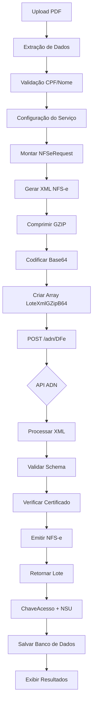

# 🔄 Guia de Migração - API ADN Oficial

## Visão Geral

Este documento detalha as alterações implementadas para adequar o sistema à **especificação OpenAPI oficial da API NFS-e ADN (Ambiente de Disponibilização Nacional)** do Gov.br.

---

## 📋 Mudanças Principais

### 1. **Endpoint Unificado**

#### ❌ Antes (Genérico)
```
POST /nfse/emitir
GET  /nfse/consultar
POST /nfse/cancelar
```

#### ✅ Agora (API ADN Oficial)
```
POST /adn/DFe  ← Único endpoint para recepção de lotes
```

### 2. **Formato de Dados**

#### ❌ Antes
- **Request:** JSON direto com dados da NFS-e
- **Processamento:** Individual ou paralelo assíncrono

#### ✅ Agora
- **Request:** XML → GZIP → Base64 → Array `LoteXmlGZipB64`
- **Processamento:** Lote sincronizado (API retorna status de todos documentos)

---

## 🔧 Arquivos Modificados

### 1. **Configurações (`.env.example` e `config/settings.py`)**

```diff
# .env.example
- NFSE_API_BASE_URL="https://api.nfse.gov.br/v1"
+ NFSE_API_BASE_URL="https://api.nfse.gov.br/adn"
+ NFSE_API_AMBIENTE="HOMOLOGACAO"  # HOMOLOGACAO ou PRODUCAO
```

```python
# config/settings.py
class Settings(BaseSettings):
    NFSE_API_BASE_URL: str = "https://api.nfse.gov.br/adn"
    NFSE_API_AMBIENTE: str = "HOMOLOGACAO"  # Novo campo
```

### 2. **Modelos Pydantic (`src/models/schemas.py`)**

**Adicionados novos modelos da API ADN:**

```python
class TipoAmbiente(str, Enum):
    PRODUCAO = "PRODUCAO"
    HOMOLOGACAO = "HOMOLOGACAO"

class MensagemProcessamento(BaseModel):
    Codigo: Optional[str]
    Descricao: Optional[str]
    Complemento: Optional[str]
    Parametros: Optional[List[str]]

class RecepcaoRequest(BaseModel):
    LoteXmlGZipB64: List[str]  # Array de XMLs comprimidos

class RecepcaoResponseDocumento(BaseModel):
    ChaveAcesso: Optional[str]
    NsuRecepcao: Optional[str]
    StatusProcessamento: Optional[str]
    Alertas: Optional[List[MensagemProcessamento]]
    Erros: Optional[List[MensagemProcessamento]]

class RecepcaoResponseLote(BaseModel):
    Lote: Optional[List[RecepcaoResponseDocumento]]
    TipoAmbiente: TipoAmbiente
    VersaoAplicativo: Optional[str]
    DataHoraProcessamento: datetime
```

### 3. **Novo Módulo: Gerador de XML (`src/utils/xml_generator.py`)**

Criado módulo completo para:
- ✅ Gerar XMLs NFS-e no padrão ADN
- ✅ Comprimir XMLs em GZIP (nível 9)
- ✅ Codificar em Base64
- ✅ Processar lotes
- ✅ Decodificar/descomprimir (para debug)

**Principais métodos:**

```python
class NFSeXMLGenerator:
    def gerar_xml_nfse(nfse_request: NFSeRequest) -> str
    def comprimir_e_codificar(xml: str) -> str
    def gerar_lote_comprimido(nfse_requests: List[NFSeRequest]) -> List[str]
    def decodificar_e_descomprimir(xml_base64: str) -> str
```

### 4. **Cliente API (`src/api/client.py`)**

#### ❌ Métodos Removidos
```python
async def emitir_nfse(payload: Dict) -> Dict
async def consultar_nfse(numero, cnpj) -> Dict
async def cancelar_nfse(numero, motivo) -> Dict
```

#### ✅ Novo Método
```python
async def recepcionar_lote(lote_xml_gzip_b64: List[str]) -> Dict:
    """
    Recepciona lote de documentos no ADN.
    
    POST /adn/DFe
    Body: {"LoteXmlGZipB64": ["H4sIAAAA...", "H4sIAAAA..."]}
    
    Returns: RecepcaoResponseLote
    """
```

### 5. **Serviço NFS-e (`src/api/nfse_service.py`)**

**Reescrito método `emitir_nfse_lote` para novo fluxo:**

```python
async def emitir_nfse_lote(registros, config_servico):
    # 1. Monta NFSeRequest para cada registro
    nfse_requests = [_build_nfse_request(reg, config) for reg in batch]
    
    # 2. Gera XMLs comprimidos
    lote_xml = self.xml_generator.gerar_lote_comprimido(nfse_requests)
    
    # 3. Envia para API ADN
    response = await self.client.recepcionar_lote(lote_xml)
    
    # 4. Processa resposta individual
    results = self._processar_resposta_lote(response, batch)
    
    return results
```

**Novo método `_processar_resposta_lote`:**
- Mapeia resposta ADN para `ProcessingResult`
- Trata status: `PROCESSADO`, `REJEITADO`, `EM_PROCESSAMENTO`
- Extrai `ChaveAcesso` (identificador único) e `NSU`
- Consolida erros e alertas

---

## 🔄 Fluxo Completo Atualizado



---

## 📊 Comparação de Payloads

### ❌ Antes (JSON Genérico)
```json
{
  "prestador": {
    "cnpj": "12345678000190",
    "inscricao_municipal": "123456"
  },
  "tomador": {
    "cpf": "12345678901",
    "nome": "João da Silva"
  },
  "servico": {
    "discriminacao": "Consultoria",
    "valor_servicos": 1000.00,
    "aliquota_iss": 5.00
  }
}
```

### ✅ Agora (API ADN Oficial)
```json
{
  "LoteXmlGZipB64": [
    "H4sIAAAAAAAA/+1cW3PbNhZ+z6/gOJO0nU4lURIlyrKzY0uO3UntOLa8zTTTGYAESKINAlwAlJz99T0ALhIpybZk2e5sOzOxROLi+3AunHMAfPx4sIAAAA...",
    "H4sIAAAAAAAA/+2dW3PbNhaA3/MrOtPuZp..."
  ]
}
```

**Conteúdo descomprimido:**
```xml
<?xml version="1.0" encoding="UTF-8"?>
<DPS xmlns="http://www.sped.fazenda.gov.br/nfse" versao="1.00">
  <Prestador>
    <CNPJ>12345678000190</CNPJ>
    <InscricaoMunicipal>123456</InscricaoMunicipal>
  </Prestador>
  <Tomador>
    <CPF>12345678901</CPF>
    <Nome>João da Silva</Nome>
  </Tomador>
  <Servico>
    <Discriminacao>Consultoria</Discriminacao>
    <Valores>
      <ValorServicos>1000.00</ValorServicos>
      <AliquotaISS>5.00</AliquotaISS>
      <ValorISS>50.00</ValorISS>
    </Valores>
  </Servico>
</DPS>
```

---

## 📨 Respostas da API

### ✅ Sucesso (201 Created)
```json
{
  "Lote": [
    {
      "ChaveAcesso": "12345678901234567890123456789012345678901234567890",
      "NsuRecepcao": "000000000001",
      "StatusProcessamento": "PROCESSADO",
      "Alertas": [],
      "Erros": []
    }
  ],
  "TipoAmbiente": "HOMOLOGACAO",
  "VersaoAplicativo": "1.0.0",
  "DataHoraProcessamento": "2026-01-11T10:30:00Z"
}
```

### ❌ Erro (400 Bad Request)
```json
{
  "type": "https://tools.ietf.org/html/rfc7231#section-6.5.1",
  "title": "One or more validation errors occurred.",
  "status": 400,
  "errors": {
    "LoteXmlGZipB64": [
      "The LoteXmlGZipB64 field is required."
    ]
  }
}
```

---

## 🧪 Como Testar

### 1. **Ambiente de Homologação**
```bash
# .env
NFSE_API_BASE_URL="https://api.nfse.gov.br/adn"
NFSE_API_AMBIENTE="HOMOLOGACAO"
```

### 2. **Executar Teste Manual**
```python
from src.utils.xml_generator import NFSeXMLGenerator
from src.models.schemas import NFSeRequest, TomadorServico, Servico, PrestadorServico, TipoAmbiente

# 1. Criar gerador
generator = NFSeXMLGenerator(ambiente=TipoAmbiente.HOMOLOGACAO)

# 2. Montar requisição
nfse_req = NFSeRequest(
    prestador=PrestadorServico(cnpj="12345678000190", ...),
    tomador=TomadorServico(cpf="12345678901", nome="João Silva", ...),
    servico=Servico(discriminacao="Teste", valor_servicos=100.00, ...)
)

# 3. Gerar XML
xml = generator.gerar_xml_nfse(nfse_req)
print(xml)

# 4. Comprimir e codificar
xml_comprimido = generator.comprimir_e_codificar(xml)
print(f"Tamanho original: {len(xml)} bytes")
print(f"Tamanho comprimido: {len(xml_comprimido)} bytes")

# 5. Enviar para API
from src.api.client import NFSeAPIClient
import asyncio

async def test():
    client = NFSeAPIClient()
    response = await client.recepcionar_lote([xml_comprimido])
    print(response)

asyncio.run(test())
```

---

## ⚠️ Breaking Changes

| Funcionalidade | Antes | Agora | Impacto |
|----------------|-------|-------|---------|
| **Formato Request** | JSON | XML → GZIP → Base64 | **CRÍTICO** - Requer geração de XML |
| **Endpoint** | `/nfse/emitir` | `/adn/DFe` | **ALTO** - URLs diferentes |
| **Processamento** | Individual | Lote sincronizado | **MÉDIO** - Lógica alterada |
| **Identificador** | `numero_nfse` | `ChaveAcesso` | **MÉDIO** - 50 caracteres |
| **Rastreamento** | `protocolo` | `NsuRecepcao` (NSU) | **BAIXO** - Mesmo conceito |
| **Ambiente** | N/A | `HOMOLOGACAO`/`PRODUCAO` | **BAIXO** - Novo campo obrigatório |

---

## ✅ Checklist de Migração

- [x] Atualizar URL base para `/adn`
- [x] Adicionar campo `NFSE_API_AMBIENTE`
- [x] Criar modelos Pydantic da API ADN
- [x] Implementar gerador de XML
- [x] Implementar compressão GZIP
- [x] Implementar codificação Base64
- [x] Atualizar cliente HTTP (`recepcionar_lote`)
- [x] Reescrever serviço de emissão em lote
- [x] Adicionar processamento de resposta ADN
- [x] Criar documentação de referência
- [x] Atualizar exemplos de payload
- [ ] Testar em ambiente de homologação
- [ ] Validar certificado digital A1
- [ ] Executar testes de carga (50 docs/lote)
- [ ] Deploy em produção

---

## 📚 Documentação Adicional

- **Especificação OpenAPI:** `docs/api_adn_reference.json`
- **Exemplos de XML:** `src/utils/xml_generator.py` (docstrings)
- **Referência Técnica:** `docs/TECHNICAL_REFERENCE.md`

---

## 🆘 Troubleshooting

### Erro: "XML mal formado"
- ✅ Validar namespace: `http://www.sped.fazenda.gov.br/nfse`
- ✅ Verificar declaração XML: `<?xml version="1.0" encoding="UTF-8"?>`
- ✅ Usar `xml.etree.ElementTree` para garantir sintaxe correta

### Erro: "Certificado inválido"
- ✅ Verificar validade do certificado A1
- ✅ Confirmar formato PEM no header `X-Certificate`
- ✅ Testar com `certificate_manager.is_valid()`

### Erro: "Lote muito grande"
- ✅ Limitar a 50 documentos por lote
- ✅ Reduzir `MAX_BATCH_SIZE` nas configurações
- ✅ Verificar tamanho do XML comprimido (< 5MB)

---

## 📞 Suporte

Para dúvidas sobre a **API ADN oficial**, consulte:
- Portal NFS-e: https://www.gov.br/nfse
- Documentação Técnica: https://www.sped.fazenda.gov.br/

---

**Data da Migração:** 11 de Janeiro de 2026  
**Versão:** 2.0.0 (API ADN Oficial)
